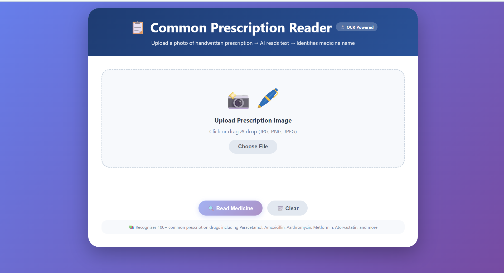
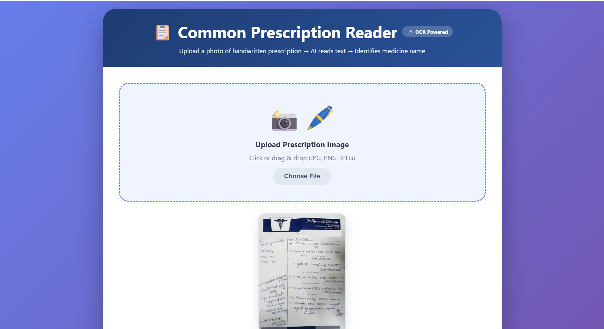
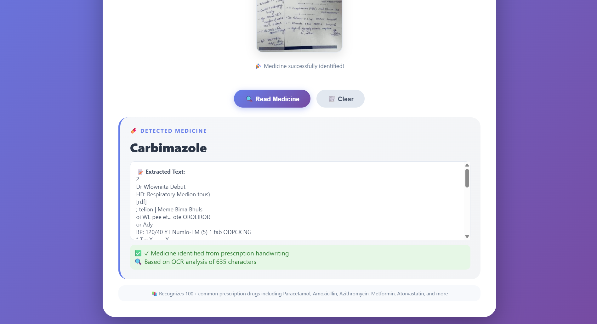

# 📋 Common Prescription Reader — OCR-Powered Medicine Detector


> **Upload a photo of a handwritten prescription → AI reads the text → Identifies the medicine name — all in the browser, no server needed.**

---

## 🖼️ Screenshots

### 🏠 Dashboard — Upload Screen


### 📄 Prescription Uploaded


### ✅ Detection Result — Carbimazole


---

## ✨ Features

- 📸 **Drag & Drop or Browse** — upload JPG, PNG, or JPEG prescription images
- 🔬 **Real OCR** — powered by [Tesseract.js v5](https://github.com/naptha/tesseract.js) for in-browser text extraction
- 💊 **100+ Medicines Recognized** — includes Paracetamol, Amoxicillin, Ciprofloxacin, Metformin, Atorvastatin, Carbimazole, and many more
- 🔤 **Shorthand & Abbreviation Support** — maps common doctor shorthand (e.g., `pcm` → Paracetamol, `cipro` → Ciprofloxacin)
- 🧠 **Smart Fuzzy Matching** — partial word matching for imperfect OCR results
- 📊 **Live Progress Bar** — real-time OCR progress indicator
- 🖥️ **Fully Client-Side** — no backend, no data upload, runs 100% in the browser
- 📱 **Responsive Design** — works on desktop and mobile

---

## 🚀 Getting Started

### Option 1 — Open Directly (No Install)

Just open `index.html` in any modern browser:

```bash
https://github.com/Vickykumar03/common-medicine-detector.git
cd common-medicine-detector
# Open index.html in your browser
```

### Option 2 — Live Server (Recommended for Development)

```bash
# Using VS Code Live Server extension, or:
npx serve .
```

Then visit `http://localhost:3000` (or the port shown).

---

## 📁 Project Structure

```
common-medicine-detector/
├── index.html              # Main HTML structure
├── style.css               # All styling
├── script.js               # OCR logic & medicine matching
├── dashboard.png           # Screenshot — upload screen
├── prescription_image.png  # Screenshot — prescription loaded
└── final_result.png        # Screenshot — detection result
```

---

## 🧠 How It Works

```
User uploads image
       ↓
Tesseract.js performs OCR
       ↓
Raw text extracted from prescription
       ↓
Text checked against:
  1. Shorthand map  (pcm → Paracetamol)
  2. Regex patterns (cipro → Ciprofloxacin)
  3. Direct DB match (100+ medicine names)
  4. Fuzzy partial match
       ↓
Medicine name displayed to user
```

---

## 💊 Supported Medicines (Sample)

| Category | Medicines |
|---|---|
| Antibiotics | Amoxicillin, Azithromycin, Ciprofloxacin, Doxycycline, Clindamycin |
| Pain Relief | Paracetamol, Ibuprofen, Naproxen, Diclofenac, Tramadol |
| Diabetes | Metformin, Sitagliptin, Glimepiride, Empagliflozin, Insulin |
| Cardiac | Atorvastatin, Losartan, Amlodipine, Metoprolol, Aspirin |
| Thyroid | Levothyroxine, Carbimazole |
| Allergy | Cetirizine, Levocetirizine, Fexofenadine, Montelukast |
| Antifungal | Fluconazole, Itraconazole |
| GI | Omeprazole, Pantoprazole, Ondansetron, Domperidone |

> Full list: 100+ medicines. See `script.js → MEDICINE_DB` for the complete database.

---

## ⚙️ Tech Stack

| Technology | Purpose |
|---|---|
| HTML5 / CSS3 | UI structure and styling |
| Vanilla JavaScript | App logic, event handling |
| [Tesseract.js v5](https://github.com/naptha/tesseract.js) | In-browser OCR engine |
| CSS Gradients & Animations | Modern UI polish |

---

## 📌 Tips for Best Results

- 📷 Use **good lighting** — avoid shadows over the text
- 🔍 Capture the prescription **straight-on** (avoid angles)
- ✍️ Works best with **printed or semi-legible handwriting**
- 🖼️ Higher resolution images yield better OCR accuracy

---

## ⚠️ Disclaimer

> This tool is intended for **educational and assistive purposes only**. It is **not a substitute for professional medical advice**. Always consult a licensed pharmacist or doctor before taking any medication. OCR on handwritten text is inherently imperfect and results may not always be accurate.

---

## 🤝 Contributing

Contributions are welcome! To add more medicines or improve matching logic:

1. Fork the repository
2. Add entries to `MEDICINE_DB` or `SHORTHAND_MAP` in `script.js`
3. Submit a pull request

---

## 📄 License

This project is licensed under the [MIT License](LICENSE).

---

<p align="center">Made with ❤️ for better healthcare accessibility</p>
